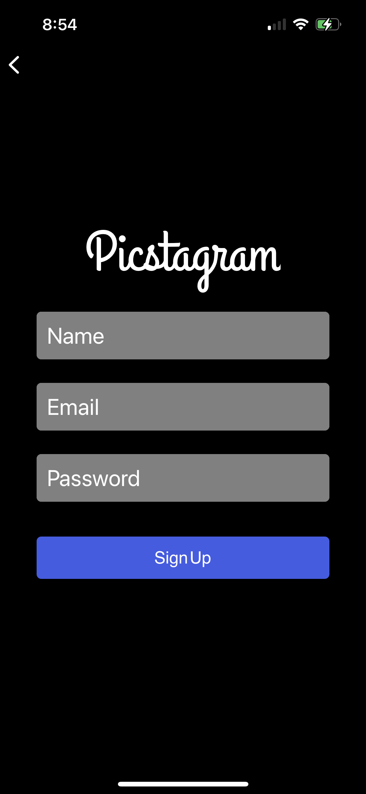

# Picstagram - A mobile app clone of Instagram, ultilizing Expo and React Native

## Current Features

 
 

### 1. Log In/Register/Logout - ultilizing Firebase

 

 &nbsp; &nbsp; &nbsp; &nbsp;
 &nbsp; &nbsp; &nbsp; &nbsp;

 
 

### 2. Feed - see post of friends on feed

 

   

 
 

### 3. Add post - utilize phone camera or gallary to add photo and caption

 

 
 

### 4. Create/View post comments

 

   

 
 

### 5. Search for users

 

   

 
 

### 6. Profile page - displays user posts, how many user they follow. Current user can logout and update profile picture from this sceen

 

 &nbsp; &nbsp; &nbsp; &nbsp;

 
 

## Upcomming Features

1. Likes
2. Delpoyment

## How to Launch the Application Locally

1. Create expo account
2. Download expo app on a mobile device
3. Sign into expo account in terminal
4. CD into ig-clone-react-native folder and run npm start
5. Open the expo app
