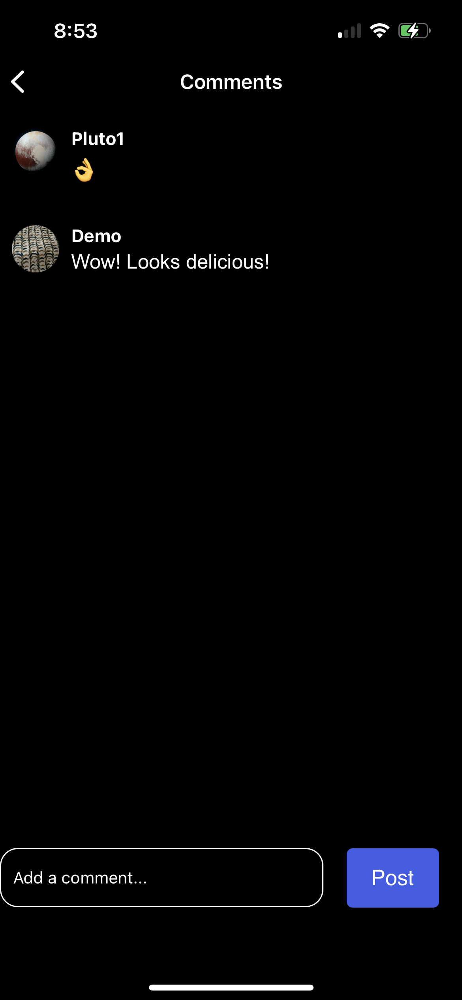

# Picstagram - A clone of Instagram's mobile app on iOS.

 
 

# Tech Stack

### 1. React Native

### 2. Expo

### 3. Firebase

### 4. Firestore

### 5. Redux

 
 
 

# Current Features

### 1. Log In/Register/Logout - ultilizing Firebase

 

 &nbsp; &nbsp; &nbsp; &nbsp;
 &nbsp; &nbsp; &nbsp; &nbsp;

 
 

### 2. Feed - see post of friends on feed

 

   

 
 

### 3. Add post - utilize phone camera or gallary to add photo and caption

 

 
 

### 4. Create/View post comments

 

   

 
 

### 5. Search for users

 

   

 
 

### 6. Profile page - displays user posts, how many user they follow. Current user can logout and update profile picture from this sceen

 

 &nbsp; &nbsp; &nbsp; &nbsp;

 
 

## Upcomming Features

1. Likes
2. Deployment to App Store

## How to Launch the Application Locally

1. Create expo account
2. Download expo app on a mobile device
3. Click link below or use QR code
    
    
   <a href='exp://exp.host/@drjson/instagram?release-channel=default'>Link to app</a>
    
    
   QR code
    
   
